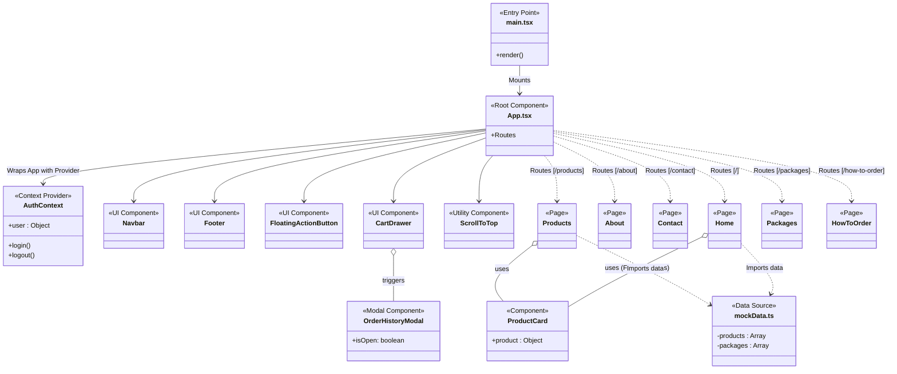

# Component & Class Diagram

โปรเจกต์นี้พัฒนาด้วย React.js ในรูปแบบ Functional Component ดังนั้น Diagram นี้จึงแสดงออกในรูปแบบของ **Component Hierarchy Architecture** เพื่อให้เห็นการไหลของข้อมูลหลัก (Data Flow) และการสืบทอด (Component Tree) รวมถึง Context API แทนที่ Class Diagram แบบดั้งเดิมใน OOP

## Component Hierarchy (Mermaid Diagram)

## คำอธิบายองค์ประกอบหลัก (Core Components Description)

### 1. Root & Configuration
- **`main.tsx`**: จุดเริ่มต้นของโปรเจกต์ React ทำการเรียก `App` ไป Mount ลงบน DOM (`id="root"`)
- **`App.tsx`**: ศูนย์กลางของทั้งหมด ประกอบไปด้วยกานจัดการ Routing (`react-router-dom`) และหุ้ม Global Components เอาไว้ เช่น Navbar, Footer เพื่อให้แสดงในทุกๆ หน้า

### 2. State Management & Context
- **`contexts/AuthContext.tsx`**: จัดการสถานะการเข้าสู่ระบบ (Authentication) แชร์ State ว่ามีผู้ใช้งานล็อกอินอยู่หรือไม่ เพื่อนำไปปรับเปลี่ยน UI บน Navbar

### 3. Pages (หน้าแสดงผลหลัก)
- **`Home`**: หน้าแรก นำเสนอร้านค้า, สินค้าแนะนำ และโปรโมชั่น
- **`Products`**: แคตตาล็อกสำหรับค้นหาและกรองสินค้าทั้งหมด 
- **`Packages`**: นำเสนอรายละเอียดการซื้อแฟรนไชส์เพื่อเปิดร้าน 20 บาท
- **`About`**: ประวัติความเป็นมาของร้านวงษ์หิรัญค้าส่ง
- **`Contact`**: ข้อมูลการติดต่อ, สาขาทั้งหมด พร้อมตำแหน่งแผนที่ (ใช้งาน `@vis.gl/react-google-maps`)
- **`HowToOrder`**: ขั้นตอนและวิธีการสั่งซื้อสินค้า

### 4. Components (ส่วนประกอบที่นำกลับมาใช้ซ้ำ)
- **`Navbar` / `Footer`**: แถบนำทางและส่วนท้าย
- **`ProductCard`**: กล่องข้อความแสดงรายละเอียดสินค้า (รูปภาพ, ชื่อ, ราคา) ถูกเรียกใช้ทั้งหน้า Home และ Products
- **`CartDrawer`**: หน้าต่างสไลด์ด้านข้างสำหรับแสดงสินค้าที่อยู่ในตะกร้า (Cart Management)
- **`OrderHistoryModal`**: Popup สรุปประวัติการสั่งซื้อ หรือเช็คคำสั่งซื้อย้อนหลัง
- **`FloatingActionButton`**: ปุ่มติดต่อด่วน (ลอยอยู่มุมจอเสมอ) 
- **`ScrollToTop`**: Utility สั่งให้หน้าเว็บเลื่อนขึ้นบนสุดเสมอเมื่อมีการเปลี่ยน URL (Route)

### 5. Services / Data Sources
- **`data/mockData.ts`**: เนื่องจากโปรเจกต์อาจจะยังไม่มี API เชื่อมต่อกับฐานข้อมูลแบบเต็มตัว ข้อมูลสินค้าต่างๆ ถูกจำลอง (Mock) ไว้ในรูปแบบ JSON / TypeScript Object Array ผ่านไฟล์นี้
