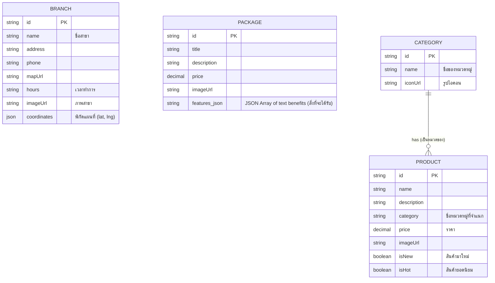

# ER Diagram (System Entity-Relationship Diagram)
## โครงสร้างหน่วยจัดเก็บจำลอง (Mock Data Structures)

เนื่องจากโครงการ WH-Website ในเพสนี้เน้นที่การจัดทำระบบการเรนเดอร์ในฝั่งหน้าบ้าน (Frontend Client) ข้อมูลจึงถูกจัดเก็บแบบ Local จำลอง (Mock Data) ผ่านการเขียนโครงสร้างด้วย TypeScript Interface ซึ่งสามารถนำแผนภาพแบบเจาะจง (ER Diagram) ดังต่อไปนี้ ไปใช้เตรียมระบบ Database ในอนาคตต่อไปได้ 

### คำอธิบายโครงสร้างก้อนข้อมูลหลัก:
1. **PRODUCT (สินค้า)**: โมเดลหลักของการประมวลผลข้อมูลหน้าจอแสดงสินค้า (Products Grid) มีแฟล็กสำหรับการกรองพิเศษเช่น `isNew` หรือ `isHot` ควบคู่ไปด้วย
2. **PACKAGE (แพ็กเกจ)**: ถือขุมทรัพย์ข้อมูลการนำเสนอแพ็กเกจแฟรนไชส์เพื่อเปิดร้าน 20 บาท ซึ่งมีชุดความสามารถย่อย (`features_json`) แนบมาให้ประมวลผลเป็น Bullet point ด้วย
3. **BRANCH (สาขา)**: โมเดลที่มีความสำคัญสำหรับการเรนเดอร์หมุดบน Google Maps โดยใช้ `coordinates` สร้างเป็น Lat/Lng Object ที่ Google Maps API เข้าใจได้
4. **CATEGORY (หมวดหมู่)**: กลุ่มที่ช่วยแยกโชว์ประเภทของสินค้าออก เพื่อสร้างระบบค้นพบสินค้าตามกลุ่ม

> **หมายเหตุ** ในระบบนี้ตารางข้อมูลและรูปแบบความสัมพันธ์ทั้งหมดไม่ได้ถูกประมวลผลด้วย SQL Engine แต่ใช้ผ่านระบบ `import` ในรูปแบบ Static TypeScript Object Array แทน (`mockData.ts`)
