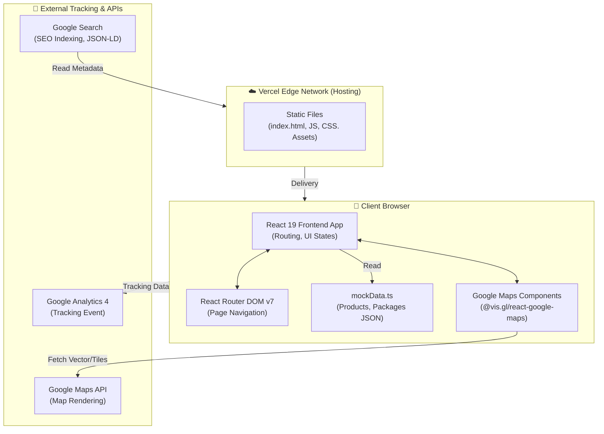

# บทนำและภาพรวมโครงการ
## อินเทอร์เฟซและเว็บไซต์หลัก — วงษ์หิรัญค้าส่ง (WongHiran Website)

**ชื่อโครงการ:** WongHiran Website (WH-Website)  
**วันที่จัดทำ:** 07 เมษายน 2569  

---

## 1. ความเป็นมาและแรงจูงใจ

ในยุคดิจิทัล การที่ร้านค้าส่งมีหน้าร้านบนโลกออนไลน์ถือเป็นตัวแปรสำคัญที่ช่วยให้เข้าถึงกลุ่มลูกค้าในวงกว้างได้ **ร้านวงษ์หิรัญค้าส่ง โคราช** เป็นศูนย์รวมสินค้าอุปโภคบริโภคขนาดใหญ่และแพ็กเกจเปิดร้าน 20 บาทชั้นนำของจังหวัด แม้ว่าทางร้านจะมีการรับออเดอร์ผ่านช่องทาง LINE เป็นหลัก แต่การให้ข้อมูลเบื้องต้นเกี่ยวกับสินค้า บริการ หรือแผนที่สาขา ยังกระจัดกระจายและยากต่อการค้นหาบน Search Engine

โครงการนี้จึงถูกสร้างขึ้นเพื่อเป็นหน้าต่างบานแรกในการต้อนรับลูกค้าที่สนใจ (Landing Platform) ด้วยการผสานดีไซน์ที่สวยงาม ทันสมัย ชูภาพลักษณ์ความเป็นผู้นำด้านการค้าส่ง พร้อมการติดระบบวิเคราะห์ (Analytics) และระบบช่วยเหลือในการนำทาง (Map Navigation) อย่างครอบคลุม 

---

## 2. วัตถุประสงค์ของโครงการ

1. **พัฒนาเว็บไซต์หลักทางการ (Official Website):** ยกระดับแบรนด์ให้มีความน่าเชื่อถือ แหล่งรวบรวมข้อมูลอย่างเป็นระบบ ศูนย์กลางของช่องทางการติดต่อทั้งหมด 
2. **นำเสนอระบบแคตตาล็อกสินค้าแบบอิเล็กทรอนิกส์ (E-Catalog):** ให้ลูกค้าค้นหาและเลือกชมสินค้าเบ็ดเตล็ดได้จากมือถือ
3. **โปรโมทและดึงดูดลูกค้า B2B:** เน้นย้ำข้อมูลเกี่ยวกับการลงทุนแพ็กเกจเปิดร้าน 20 บาท พร้อมให้คำปรึกษาการทำธุรกิจ
4. **เพิ่มประสิทธิภาพในการค้นหา (SEO Ready):** จัดโครงสร้าง Markup และ JSON-LD Schema ให้ติดอันดับบนผลลัพธ์ของ Google ทันทีที่ค้นหาคำว่า "ค้าส่งโคราช" หรือ "ร้านยี่สิบบาท"
5. **เพิ่มการติดต่อแบบไร้รอยต่อ (Seamless Contact):** ให้ลูกค้านำทางผ่าน Google Maps ตรงมายังสาขาต่างๆ หรือกดแอดไลน์ได้ทันที 

---

## 3. ขอบเขตของโครงการ

### 3.1 สิ่งที่อยู่ในขอบเขต (In Scope)

| หมวด | รายละเอียด |
| :--- | :--- |
| **โครงสร้างหน้าเพจ** | หน้าหลัก (Home), เกี่ยวกับเรา (About), แพ็กเกจค้าส่ง (Packages), สินค้า (Products), เมนูติดต่อ (Contact), วิธีสั่งซื้อ (HowToOrder) |
| **ระบบแคตตาล็อก** | ค้นหาแบบอิสระ (Search), ฟิลเตอร์ตามหมวดหมู่ (Category Filter), การแสดงรูปภาพ |
| **ข้อมูลทางภูมิศาสตร์** | แสดงจุดที่ตั้งทั้ง 4 สาขา พร้อม Embed Google Maps API |
| **การเชื่อมโยงระบบ** | ลิงก์ช่องทางโซเชียล (Facebook, LINE), โชว์ระบบตะกร้าจำลอง (CartDrawer UI) |
| **การตลาด (Marketing)** | ติดตั้ง Google Analytics 4 (DataLayer), Meta Tag สำหรับ SEO + Open Graph Social Share |
| **การเรนเดอร์** | แบบจำลองข้อมูล JSON ภายในฝั่ง Frontend (Mock Data) ไม่ต่อฐานข้อมูลใน Phase นี้ |

### 3.2 สิ่งที่ไม่อยู่ในขอบเขต (Out of Scope)

- ระบบฐานข้อมูลหลังบ้าน (Database / Backend API)
- ระบบจัดการเนื้อหา (CMS / Admin Panel)
- ระบบการชำระเงินผ่านบัตรเครดิต หรือ บัญชีธนาคาร 
- ระบบบริหารจัดการลูกค้าระยะยาว (CRM System) 

---

## 4. ภาพรวมระบบ (System Overview)

### 4.1 สถาปัตยกรรมระบบ (Architecture)

โครงการเว็บไซต์ วงษ์หิรัญค้าส่ง เน้นหนักไปที่สถาปัตยกรรม **Client-Side Rendering (CSR)** ด้วยกระบวนการ Build อันทรงพลังของ Vite แตกต่างจากระบบ Commerce ตรงที่ไม่ต้องรอการเรียก API จาก Backend 



### 4.2 โครงสร้างเนื้อหาและการนำทาง (Website Structure)

```
WongHiran Website
│
├── 🏠 หน้าหลัก (`/`)
│   ├── Hero Section วีดีโอหรือภาพแบนเนอร์ร้าน
│   ├── สินค้าไฮไลต์ และแพ็กเกจน่าสนใจ
│   └── Call to Action (คลิกติดต่อไปที่ LINE)
│
├── 📦 หน้าสินค้า (`/products`)
│   ├── เมนูค้นหาสินค้า / ฟิลเตอร์หมวดหมู่
│   ├── Product Grid แสดงรูป ราคา และรายละเอียดสินค้ารายชิ้น
│   └── UI จำลองระบบเพิ่มลงตะกร้า (Cart Drawer)
│
├── 💼 หน้าแพ็กเกจ (`/packages`)
│   └── ตารางเปรียบเทียบและการนำเสนอแพ็กเกจเปิดร้าน 20 บาท
│
├── ℹ️ หน้าเกี่ยวกับเรา (`/about`)
│   └── ประวัติความเป็นมา ความน่าเชื่อถือของวงษ์หิรัญ
│
├── 📍 หน้าติดต่อเรา (`/contact`)
│   ├── ฟอร์มสอบถามรายละเอียดเบื้องต้น (UI)
│   ├── รายละเอียดสาขา (สาขาหลัก ต.บ้านเกาะ และสาขาย่อย)
│   └── แผนที่ Google Maps
│
└── 🛈 หน้าขั้นตอนสั่งซื้อ (`/how-to-order`)
```

---

## 5. เทคโนโลยีที่ใช้พัฒนา (Tech Stack)

| องค์ประกอบ | เทคโนโลยี | เวอร์ชัน | รายละเอียด |
| :--- | :--- | :---: | :--- |
| **Frontend Core** | React | 19.x | Library หลักสำหรับการประกอบ Component |
| **Language** | TypeScript | 5.8 | เข้มงวดเรื่องโครงสร้างข้อมูล ลดความผิดพลาด |
| **Build Tool** | Vite | 6.2 | สร้างโปรเจกต์ไว โหลด Module สำหรับ Dev ได้เร็วมาก |
| **Routing** | React Router | 7.1 | ควบคุมการเปลี่ยนหน้าต่าง (SPA Navigation) |
| **Styling** | Tailwind CSS | 4.1 | เขียนคลาส CSS รวดเร็ว (Utility First) |
| **UI Icons** | Lucide React | 0.5 | ไอคอนเวกเตอร์ที่ดูทันสมัย มินิมอล |
| **Animations** | Motion / Swiper | 12.x / 12.x | สร้างลูกเล่นแอนิเมชัน และระบบสไลด์เกลอรีภาพ |
| **Maps** | vis.gl React Maps | 1.7 | นำ Google Maps ลง Component ของ React โดยตรง |

---

## 6. ความสำเร็จของโครงการ (Project Achievements)

| ✅ ฟีเจอร์ที่สำเร็จ | รายละเอียด |
| :--- | :--- |
| การแสดงผลผ่านทุกอุปกรณ์ (Responsive UIs) | เว็บไซต์แสดงผลได้สมบูรณ์ตั้งแต่จอ 320px ไปจนถึง 1920px (Desktop) |
| โครงสร้างแคตตาล็อกสินค้ากว่า 1,000 รายการ | สร้าง Mock Data ครอบคลุมประเภทสินค้า และเรนเดอร์ใน Grid Layout สำเร็จ |
| ทำงานรวดเร็ว (High Performance Caching) | การใช้ Vite Builder รีดประสิทธิภาพ Static File ทำให้หน้าร้านโหลดเสร็จในเสี้ยววินาที |
| Google Maps Integration | สลับแผนที่และปักหมุดสาขาได้แบบ Interactive |
| Floating Action Component | ปุ่มลัดโทรด่วน และ LINE ลอยติดจอ เพิ่มอัตรา Conversion ตอบสนองความต้องการ |
| การติดตั้ง SEO Tags ล่วงหน้า | เพิ่มฐานความรู้ JSON-LD สำหรับระดับองค์กรค้าส่งเพื่อให้เสิร์ชเอนจินจำแนกง่ายขึ้น |
| โครงสร้าง Vercel Deployment | เว็บไซต์พร้อมใช้การเซ็ตค่า `vercel.json` ขึ้นโฮสต์ออนไลน์เพื่อรองรับ Routing ทันที |

---

## 7. เอกสารที่เกี่ยวข้อง

| เอกสาร | คำอธิบาย |
| :--- | :--- |
| [SRS.md](./SRS.md) | Software Requirements Specification — รวมรายละเอียดสเปกของเว็บนี้ |
| [Class Diagram.md](./Class%20Diagram.md) | Class Diagram รูปแบบ Component Hierarchy ร่างโครงสร้างระหว่างหน้าต่างๆ |
| [Data_Dictionary.md](./Data_Dictionary.md) | พจนานุกรมข้อมูล (อธิบายตัวแปรของ Mock Data) |
| [Master_Data.md](./Master_Data.md) | ข้อมูล Lookup/Reference หมวดหมู่สินค้า |
| [Development_Environment.md](./Development_Environment.md) | สภาพแวดล้อม รันไทม์ และระบบที่รองรับการพัฒนา |
| [SEO_Google_Analytic.md](./SEO_Google_Analytic.md) | แผนและรายละเอียดการติดตั้งระบบ Tracking อนาไลติกส์ของโครงการนี้ |
| [Test_Cases.md](./Test_Cases.md) | ชุดทดสอบการทำงานของเว็บไซต์ฝั่งหน้าบ้าน | 
| [Setup_Deployment_Guide.md](./Setup_Deployment_Guide.md) | คู่มือลัดสำหรับการ Build พับลิชและใช้งานบน Production |

---

*เอกสารนี้จัดทำเพื่อสรุปและชี้แจงภาพรวมของวงษ์หิรัญค้าส่งส่วนเว็บไซต์หน้าบ้าน (WH-Website)*  
*วันที่ปรับปรุงเนื้อหาเอกสารล่าสุด: 07 เมษายน 2569*
